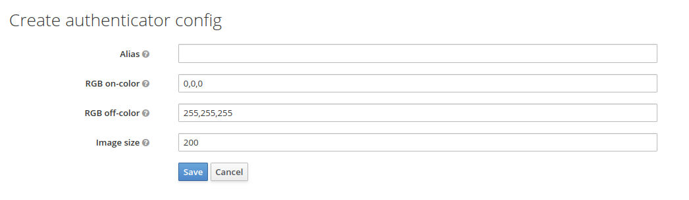

# LNURL-auth Keycloak plugin

## Authorization with Bitcoin Wallet

A special `linkingKey` can be used to login user to a service or authorise sensitive actions. This preferrably should be done without compromising user identity so plain LN node key can not be used here. Instead of asking for user credentials a service could display a "login" QR code which contains a specialized `LNURL`.

## This plugin enables lnurl-auth authentication
See [here](https://github.com/lnurl/luds/blob/legacy/lnurl-auth.md) for extensive outline of the protocol and auth flow.

## Feedback
Authentication happens [LnUrlAuthenticator.class](src/main/java/org/noderunners/authentication/lnurl/LnUrlAuthenticator.java)

## LNURL Overview

## Settings
Configure the QR-code image generation   

LN-Url requires https, therefor for testing purposes use ngrok or similar tools to proxy to your local environment.
Set the frontend-url in the Real Settings | General tab to something like : https://[subdomain].ngrok.io/auth/ and set the Web Origins in the client settings to https://[subdomain].ngrok.io

What users see:   
