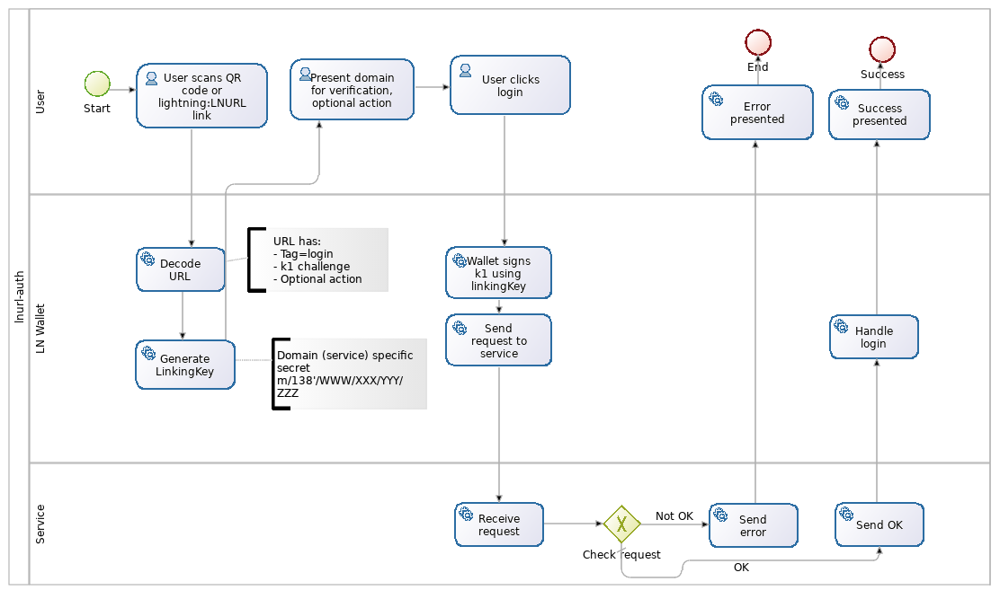
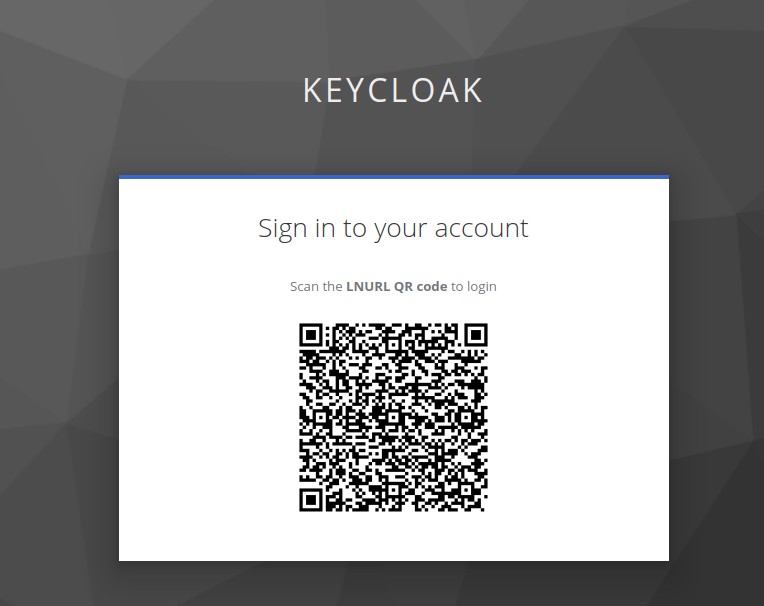

# LNURL-auth Keycloak plugin


## Authorization with Bitcoin Wallet

A special `linkingKey` can be used to login user to a service or authorise sensitive actions. This preferrably should be done without compromising user identity so plain LN node key can not be used here. Instead of asking for user credentials a service could display a "login" QR code which contains a specialized `LNURL`.

## This plugin enables lnurl-auth authentication
See [here](https://github.com/lnurl/luds/blob/legacy/lnurl-auth.md) for extensive outline of the protocol and auth flow.

## Feedback
Authentication happens [LnUrlAuthenticator.class](src/main/java/org/noderunners/authentication/lnurl/LnUrlAuthenticator.java)

the front-end polls for success on LNUrlResource url.
```html
        <script type="text/javascript">
                var url = '${pollingUrl}'.replaceAll('amp;', '');

                var refreshIntervalId = setInterval(function(){
                    fetch(url)
                    .then( (response) => {
                            if (response.ok) {
                                clearInterval(refreshIntervalId);
                                console.log("POSTing kc-form-login");
                                document.getElementById("kc-form-login").submit();
                            }
                        }
                    )
                }, 3000);
            </script>
```

Please, any feedback is welcome!

## LNURL Overview


What users see:   
